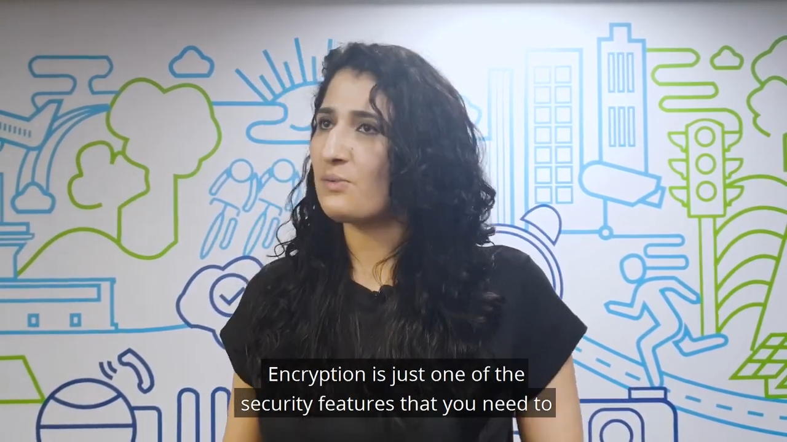

Welcome to the OWASP Product Security Guide!

Your trusted resource for securing modern products with practical insights, cutting-edge tools, and actionable recommendations.

---

What This Guide Covers

This guide focuses on three key aspects:
1. [How products are being attacked?](#how-products-are-being-attacked)
2. [How to secure products?](#how-to-secure-products)
3. [The role of AI/LLM in product security](#role-of-ai-llm-in-product-security)

Modern security demands go beyond application-level issues to address **product-level risks** like design flaws, supply chain vulnerabilities, and challenges posed by **AI/LLMs**. This guide will help you build secure, privacy-preserving, and resilient products.

---

Featured Resources

Get up to speed with these quick resources:
- [Recording: Rob van der Veer’s OWASP Talk](https://youtu.be/ol-z_ShulCc?si=xmPFkpjrwrxNYQSX)
- [Slides from OWASP Global AppSec 2023](https://github.com/OWASP/www-project-ai-security-and-privacy-guide/blob/main/assets/images/20230215-Rob-AIsecurity-Appsec-ForSharing.pdf?raw=true)
- AppSec Podcast ([Audio](https://www.buzzsprout.com/1730684/12313155-rob-van-der-veer-owasp-ai-security-privacy-guide), [Video](https://www.youtube.com/watch?v=SLdn3AwlCAk&))
- [The 5-Minute Product Security Quick-Talk](https://youtu.be/D6YRQYHVHao?si=Ua_TG5tqy_YiYaVG)

---

Get Involved

Help improve this guide with your contributions!  
- Submit feedback via [pull requests](https://owasp.org/www-project-product-security-guide/#) or [issues](https://github.com/OWASP/www-project-product-security-guide/issues).  
- Share ideas with the project lead via email.  

Special thanks to **[Scott Bauer](https://www.linkedin.com/in/scott-bauer-90a55531/overlay/about-this-profile/)**, Lead Product Security at Qualcomm, for his valuable contributions.

---

## How Products Are Being Attacked?

Attackers exploit vulnerabilities in the **SDLC** and **supply chain** through various means:

- **Code Injection**: Exploiting weak input validation to execute unauthorized commands.
- **Dependency Confusion**: Replacing trusted libraries with malicious alternatives.
- **Hijacking**: Compromising authentication and authorization mechanisms.

These methods emphasize the need for **robust security measures** across the product lifecycle. Learn more about key threats and techniques [here](https://jfrog.com/blog/the-importance-of-prioritizing-product-security/).

---

## How to Secure Products?

### Part 1: Foundations of Secure Product Design

#### Threat Modeling
- **Identify**: Key assets, potential threats, and attack vectors.
- **Frameworks**: Use tools like **STRIDE** or **PASTA** to model risks.
- **SDLC Integration**: Incorporate threat modeling into design reviews and planning.

#### Secure Architecture Principles
- Implement **Defense-in-Depth** with layered controls.
- Enforce **Least Privilege** and secure communication with **TLS** and **AES-256** encryption.

#### Secure Configuration Management
- Enforce hardened defaults and automate updates using tools like **Ansible** or **Terraform**.
- Monitor CVEs and proactively address vulnerabilities.

---

### Part 2: Securing the Development Lifecycle (SDLC)

#### Secure Development Practices
- Write secure code with validated inputs and sanitized outputs.
- Use **OWASP Dependency-Check** to ensure library security.

#### Testing and Verification
- Use tools like **OWASP ZAP** for **SAST** and **DAST**.
- Conduct penetration tests and simulate real-world attacks.

#### Secure Deployment and Operations
- Plan incident response and monitor vulnerabilities after deployment.

---

## The Role of AI/LLM in Product Security

AI/LLMs are transforming security but also introducing new risks:
- **Benefits**: Automated code analysis, threat detection, and incident response.
- **Challenges**: Bias, poisoning attacks, and dependency risks.
- **Mitigation**: Use unbiased training data and audit models regularly.

---

## Key Takeaways

- **Comprehensive Guide**: Covers threats, defenses, and best practices.
- **Action-Oriented**: Includes actionable steps and tool recommendations.
- **OWASP Tools**: Leverage trusted resources like the **OWASP Top 10**, **Dependency-Check**, and **ZAP**.

Explore the OWASP Product Security Guide to build secure, privacy-first, and resilient products!
